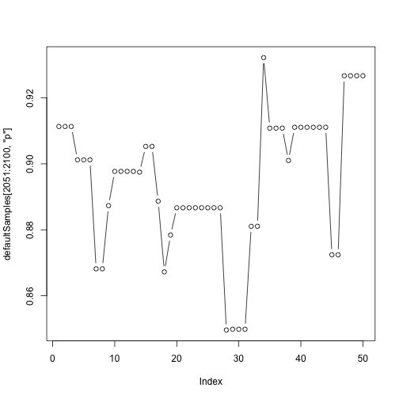

# Overview

* NIMBLE allows fine-grained control over how MCMC is done.
* Often, great improvements can be made.
* First, we need a way to measure performance.

# Example: Dipper capture-recapture (CJS) model

The dipper example is introduced [here](../example_CJS_dipper/example_CJS_dipper_slides.html)


```r
dipper_model <- nimbleModel(dipper_code,
                            constants = dipper_constants,
                            data = dipper_data,
                            inits = dipper_inits)
```

```
## defining model...
```

```
## building model...
```

```
## setting data and initial values...
```

```
## running calculate on model (any error reports that follow may simply reflect missing values in model variables) ... 
## checking model sizes and dimensions... This model is not fully initialized. This is not an error. To see which variables are not initialized, use model$initializeInfo(). For more information on model initialization, see help(modelInitialization).
## model building finished.
```

```r
defaultMCMCconf <- configureMCMC(dipper_model)
defaultMCMC <- buildMCMC(defaultMCMCconf)
## We can compile both in one step
dipper_compiled <- compileNimble(dipper_model, defaultMCMC)
```

```
## compiling... this may take a minute. Use 'showCompilerOutput = TRUE' to see C++ compiler details.
## compilation finished.
```

```r
CdefaultMCMC <- dipper_compiled$defaultMCMC
## Illustration of running MCMC "directly"
CdefaultMCMC$run(5000)
```

```
## |-------------|-------------|-------------|-------------|
## |-------------------------------------------------------|
```

```
## NULL
```

```r
defaultSamples <- as.matrix(CdefaultMCMC$mvSamples)
## Do burn-in manually when running in this mode
defaultSamples <- defaultSamples[1001:5000,]
dir.create('default_samples_plots', showWarnings = FALSE)
mcmcplot(defaultSamples, dir = 'default_samples_plots')
```

```
## 
                                                                           
Preparing plots for p.  50% complete.
```

```
## 
                                                                           
Preparing plots for phi.  100% complete.
```


                                                                           

MCMC plots are [here](default_samples_plots/MCMCoutput.html)

# Effective sample size for one node (parameter or latent state)

- When looking at the MCMC traceplot for one variable, we see that
samples are not sequentially independent.  That is the nature of MCMC.


```r
plot(defaultSamples[2051:2100, 'p'], type = 'b') 
```



In this case we see both autocorrelation and Metropolis-Hastings
rejections, which have occurred when the state does not change.  (This
does not happen in JAGS, because it does not use Metropolis-Hastings.)

- *Effective sample size (ESS)* is the equivalent number of
independent samples in an MCMC chain for one parameter.

# What does "equivalent number of independent samples" mean?

- If `p[i]` were drawn independently (m samples), we could say:

$\mbox{Var}[\overline{p[i]}] = \mbox{Var}[ \frac{1}{m} \sum_{i = 1}^m p[i] ]= \frac{\mbox{Var}[p[i]]}{m}$

- Instead, we have

$\mbox{Var}[\overline{p[i]}] = \frac{\mbox{Var}[p[i]]}{\mbox{ESS}}$

where ESS is the *Effective Sample Size*.


```r
library(coda)
effectiveSize(defaultSamples)
```

```
##        p      phi 
## 326.5846 711.7418
```

We can see that the effective sample size is considerably smaller than the number of samples (4000, in this case).

# Measuring MCMC performance: MCMC efficiency

- We define *MCMC efficiency* as

$\frac{\mbox{ESS}}{\mbox{computation time}}$

- This is the number of effectively independent samples generated per time.
- ESS is different for every parameter.
- Computation time is the same for every parameter: the total time.
- We do not count setup steps like model building and compilation as
  part of computation time.  Even
  though these take time, we are more interested in the final MCMC
  performance.
- One needs a reasonable sample just to get a reasonable estimate of ESS.
- We generally do not thin when comparing methods because thinning always removes some information from a sample.  People might disagree on this choice.

# A single number: Minimum MCMC efficiency

- We want a single number to measure the performance of an MCMC.
- Often there are many fast-mixing parameters and one or a few
slow-mixing ones.
- We need all parameters to be mixed well to rely on results.
- Therefore our single measure of efficiency is:

# Why we don't care as much about mean MCMC efficiency

- It is tempting to think mean (across parameters) of MCMC efficiency is a good measure of overall performance.
- If you rely on mean efficiency, you could end up like the statistician who drowned in a river with an average depth of three feet.
- If some parameters are mixing very well and others very poorly, you should not feel the results are acceptable.

**Net MCMC efficiency = Minimum MCMC efficiency over all parameters**

