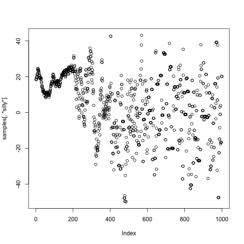
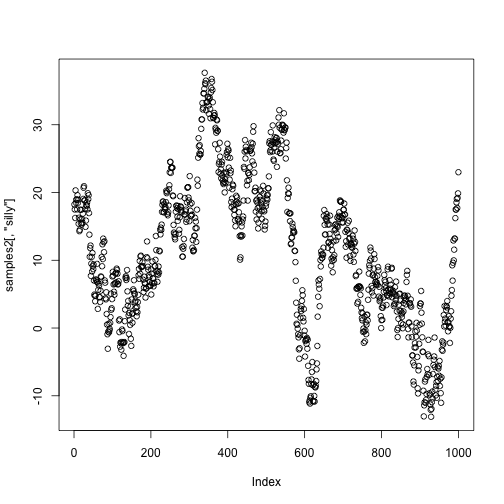
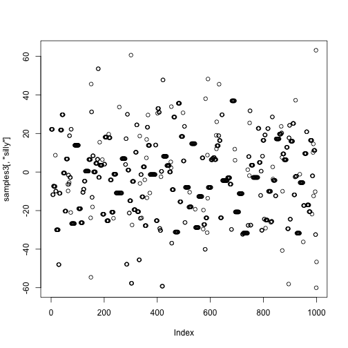

# Look at the samplers that come in NIMBLE

You can find NIMBLE's samplers in the source code on GitHub or CRAN.  [Here it is on GitHub.](https://github.com/nimble-dev/nimble/blob/devel/packages/nimble/R/MCMC_samplers.R)

# Required arguments and methods for a sampler `nimbleFunction`

- It must contain the argument `contains = sampler_BASE`.

    - (This is a simple class inheritance system that mimic's R's `contains` argument.)

- The `setup` function must take the arguments `model`, `mvSaved`, `target`, and `control`.

    - `model` is the model being sampled.
    - `mvSaved` is a length-one *modelValues* object that keeps an up-to-date copy of all model values, including log probabilities.
    - `target` is a vector of node names to be sampled.
    - `control` is a list that can contain whatever elements you want.

- The `run` function (method) must execute the sampler.

- The `reset` method must reset the sampler if that means anything for the particular sampler.

    - Example: An adaptive sampler would reset its proposal distribution.

- If the sampler is defined in package source code, it must contain `where = getLoadingNamespace()`.

    - We don't need that today.

# Required behavior of a sampler:

- Upon entry, the sampler can assume that `mvSaved[[1]` contains a complete copy of the model's variables, including logProb variables.

- The sampler may do whatever it wants (assuming it is valid for MCMC) in its `run` function, including modifying values of model variables, including logProb variables.

- Upon exiting the `run` function, `mvSaved[[1]]` must again contain a complete copy of the model's variables, including logProb variables.

    - The `mvSaved[[1]]` is like the "current" state of the model.
    - The `run` function puts proposed values in the model and does appropriate calculations.
    - If the proposal is rejected: copy from `mvSaved[[1]]` to the model.
    - If the proposal is accepted: copy from the model to `mvSaved[[1]]`.

# Example: write random-walk Metropolis-Hastings

Let's sample the world's simplest model:


```r
nimbleOptions(verbose = FALSE)
```


```r
simpleModel <- nimbleModel(
    nimbleCode({silly ~ dnorm(0, sd = 20)})
)
```


```r
MCMCconf <- configureMCMC(simpleModel, nodes = NULL)
MCMCconf$addSampler(target = "silly", type = "RW")
## Otherwise it would be sampled by a posterior predictive
## sampler, which would not be interesting!
MCMC <- buildMCMC(MCMCconf)
```

## Let's even run this uncompiled:

```r
MCMC$run(1000)
```

```
## |-------------|-------------|-------------|-------------|
## |-------------------------------------------------------|
```

```r
samples <- as.matrix(MCMC$mvSamples)
plot(samples[,"silly"])
```



# Write our own RW-MH sampler (non-adaptive)

Let's do this together

# Write our own RW-MH sampler (non-adaptive)


```r
our_RWMH <- nimbleFunction(
    contains = sampler_BASE,
    setup = function(model, mvSaved, target, control) {
        scale  <- if(!is.null(control$scale))         control$scale         else 1
        calcNodes <- model$getDependencies(target)
    },
    run = function() {
        currentValue <- model[[target]]
        propValue <- rnorm(1, mean = currentValue,  sd = scale)
        model[[target]] <<- propValue
        logMHR <- calculateDiff(model, calcNodes)
        jump <- decide(logMHR)
        if(jump) nimCopy(from = model, to = mvSaved, row = 1, nodes = calcNodes, logProb = TRUE)
        else     nimCopy(from = mvSaved, to = model, row = 1, nodes = calcNodes, logProb = TRUE)
    },
    methods = list(
        reset = function() {}
    )
)
```

# Use the sampler

## Small proposal sd


```r
MCMCconf2 <- configureMCMC(simpleModel, nodes = NULL)
MCMCconf2$addSampler(target = "silly", type = our_RWMH, control = list(scale = 2))
MCMC2 <- buildMCMC(MCMCconf2)
```


```r
MCMC2$run(1000)
```

```
## |-------------|-------------|-------------|-------------|
## |-------------------------------------------------------|
```

```r
samples2 <- as.matrix(MCMC2$mvSamples)
plot(samples2[,'silly'])
```



## Try debugging out sampler

## Big proposal sd


```r
MCMCconf3 <- configureMCMC(simpleModel, nodes = NULL)
MCMCconf3$addSampler(target = "silly", type = our_RWMH, control = list(scale = 100))
MCMC3 <- buildMCMC(MCMCconf3)
```


```r
MCMC3$run(1000)
```

```
## |-------------|-------------|-------------|-------------|
## |-------------------------------------------------------|
```

```r
samples3 <- as.matrix(MCMC3$mvSamples)
plot(samples3[,'silly'])
```




